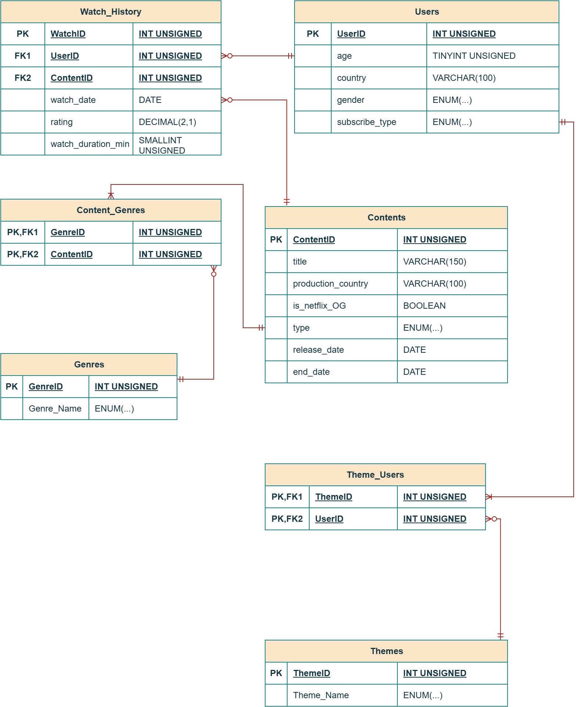

# 🎬 Netflix Database Simulation: SQL & Relational Design

A robust relational database system simulating core platform operations of Netflix, architected in **Third Normal Form (3NF)** using **MySQL**.

Leverages 5 business intelligence queries to optimize content strategy, viewer engagement, and catalog utilization.

---

## 📌 Overview
This project simulates the core relational backend of the Netflix streaming platform. The schema bridges subscriber demographics and onboarding interest preferences with an extensive content catalog (covering formats, genres, production hubs, and original titles) alongside granular watch history and rating logs.

The system delivers actionable business intelligence to drive data-backed content acquisition, catalog auditing, licensing renewals, and subscriber retention strategies.

---

## 📁 Repository Structure
```text
├── netflix_project_db.sql                                    # DDL: Schema creation, table definitions & integrity constraints
├── netflix_project_data.sql                                  # DML: Data insertion script across all 7 tables
├── netflix_project_queries.sql                               # SQL: 5 strategic analytical queries
├── Netflix_ERD.png                                           # Visual ERD architecture preview
├── Netflix_ERD.pdf                                           # Formal architectural ERD document
├── Relational Databases & SQL - Netflix Database Simulation.pdf # Full comprehensive project report
└── README.md                                                 # Project overview and documentation
```

---

## 🏗️ Database Architecture & Design

The database enforces strict referential integrity constraints across 7 normalized tables, decoupling categorical attributes into dedicated lookup entities linked via composite-key junction tables.

* **Core Entities:** `users`, `contents`, `genres`, `themes`, `watch_history`
* **Junction Tables (M:N):** `content_genre`, `theme_users`
* **Normalization Standard:** Fully compliant with 1NF, 2NF, and 3NF to eliminate insertion, update, and deletion anomalies.

### Entity-Relationship Diagram (ERD)


*(For formal vector diagram and cardinality documentation, refer to `Netflix_ERD.pdf`)*

---

## 🔍 Analytical Dimensions & Business Intelligence

The database is queried across 5 strategic business dimensions:

1. **Cross-Sectional Preference Alignment:** Evaluates behavioral discrepancies between subscriber onboarding interest themes and actual watched genres using multi-table aggregations.
2. **Demographic Audience Profiling:** Analyzes subscriber age cohorts, session volumes, and satisfaction ratings across declared interest categories.
3. **Production Hub Efficiency:** Benchmarks normalized viewing performance (`views_per_title`) and critical reception ($\ge 4.0$) for Netflix Originals across international production hubs.
4. **Episodic Catalog Performance:** Assesses catalog depth, critical reception, and streaming volume specifically across serialized television formats.
5. **Catalog Utilization & Dormancy Audit:** Identifies unstreamed "dormant assets" (0 views) alongside active catalog titles using `LEFT JOIN` logic to inform catalog pruning and recommendation prioritization.

---

## 🚀 How to Execute

To deploy and test the database locally in MySQL Workbench or CLI:

1. **Build Database Schema:**
```sql
SOURCE netflix_project_db.sql;
```

2. **Populate Mock Dataset:**
```sql
SOURCE netflix_project_data.sql;
```

3. **Run Analytical Queries:**
```sql
SOURCE netflix_project_queries.sql;
```